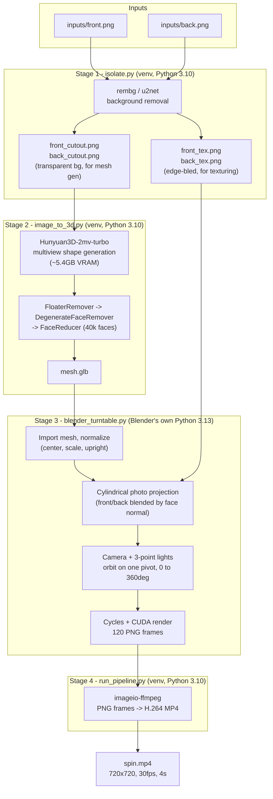

# Product 360 Video Pipeline

Generates a 360-degree turntable video of a product from two photos (front + back),
entirely locally — no paid APIs, no API keys. A real 3D mesh is reconstructed from
the photos, so the rotation is geometrically correct rather than an AI guess at
in-between frames.

## Architecture



**Why a real mesh instead of video diffusion:** an earlier version of this project
used a video-diffusion model (Wan2.1-VACE) to hallucinate frames between the two
photos. It was slower, non-deterministic, and the product could warp mid-spin. Since
the camera here orbits real reconstructed geometry, the 360 is correct by
construction and can be re-rendered at any resolution/length/FPS without re-running
any AI model.

**Why Blender runs as a subprocess, not an import:** Blender bundles its own Python
(3.13) and cannot be `pip install`-ed into a 3.10 venv (the `bpy` wheel requires
Python 3.13). `run_pipeline.py` therefore shells out to the Blender binary for stage
3; stages 1, 2, and 4 run in this project's normal venv.

## Directory layout

| Path | What it is |
|---|---|
| `isolate.py` | Stage 1: background removal |
| `image_to_3d.py` | Stage 2: photos -> 3D mesh |
| `blender_turntable.py` | Stage 3: texture + render (runs inside Blender) |
| `run_pipeline.py` | Orchestrator: runs all 4 stages, or a subset with `--skip` |
| `setup_blender.sh` | One-time: downloads Blender 5.2 LTS into `./blender/` |
| `requirements.txt` | Python deps for the venv (stages 1, 2, 4) |
| `Hunyuan3D-2/` | Shape-generation model repo, vendored as a git submodule (`hy3dgen` package) |
| `blender/` | Extracted Blender 5.2 LTS binary |
| `inputs/` | Your input photos (`front.png` / `back.png`) |
| `output/` | Intermediate artifacts: cutouts, mesh, rendered frames |
| `spin.mp4` | Final output video |

## Prerequisites

- Linux (tested on Ubuntu 22.04 / WSL2) with an NVIDIA GPU, CUDA driver installed
- Python 3.10 venv at `.venv/` with `requirements.txt` installed
- `torch` + `torchvision` installed separately, matching your CUDA version (see note
  in `requirements.txt` — do **not** let a bare `torch` install replace a working
  CUDA build)
- The `Hunyuan3D-2` submodule checked out alongside these scripts:
  ```bash
  git submodule update --init
  ```
  (or clone this repo with `git clone --recurse-submodules` in the first place)
- Blender 5.2 LTS downloaded locally (no sudo, no apt):
  ```bash
  ./setup_blender.sh
  ```

Minimum practical hardware: an 8GB VRAM GPU (shape generation peaks around 5.4GB)
and enough system RAM that nothing else is competing for it during model load
(observed peak ~12GB host RAM briefly during stage 2).

## Running it

Full pipeline, from your two photos to a finished video:

```bash
.venv/bin/python run_pipeline.py --front inputs/front.png --back inputs/back.png --output spin.mp4
```

Defaults: 720x720 resolution, 120 frames, 30fps (a 4-second loop), Cycles+CUDA
rendering, cylindrical photo projection.

### Useful flags

```bash
# Higher resolution / longer clip
.venv/bin/python run_pipeline.py --front inputs/front.png --back inputs/back.png \
    --output spin.mp4 --res 1080 --frames 240

# Re-render only (skip re-running background removal and mesh generation,
# e.g. while tuning lighting/projection)
.venv/bin/python run_pipeline.py --front inputs/front.png --back inputs/back.png \
    --output spin.mp4 --skip isolate mesh

# Calibration pass: 4 stills at 0/90/180/270 degrees instead of a full render,
# to check the mesh is right-side-up and facing the right way before spending
# minutes on a full render
.venv/bin/python run_pipeline.py --front inputs/front.png --back inputs/back.png \
    --calibrate

# If the product's front doesn't face the camera at frame 1, nudge it:
.venv/bin/python run_pipeline.py --front inputs/front.png --back inputs/back.png \
    --output spin.mp4 --yaw-offset 90
```

Run any single stage directly for debugging:

```bash
.venv/bin/python isolate.py --inputs inputs/front.png inputs/back.png --outdir output
.venv/bin/python image_to_3d.py --front output/front_cutout.png --back output/back_cutout.png --output output/mesh.glb
LD_LIBRARY_PATH=/usr/lib/wsl/lib ./blender/blender --background --python blender_turntable.py -- \
    --mesh output/mesh.glb --front output/front_tex.png --back output/back_tex.png --outdir output/frames --res 720 --frames 120
```

## Known limitations

- Only front and back photos are used; the pipeline supports `--left`/`--right` in
  `image_to_3d.py` too, but without them the mesh's sides are extrapolated and the
  side-facing texture (roughly the +/-90 degree region) is less detailed than the
  front/back. Adding left/right photos improves both.
- This is shape-only reconstruction — no AI texture generation. Texture comes from
  projecting your real photos onto the mesh, which looks better for a real product
  than an AI-invented material but has no information about surfaces neither photo
  can see (directly behind the handle, the inner rim, etc).
- OptiX GPU rendering does not work in this WSL2 environment; the script
  automatically falls back to CUDA, which works fine.
